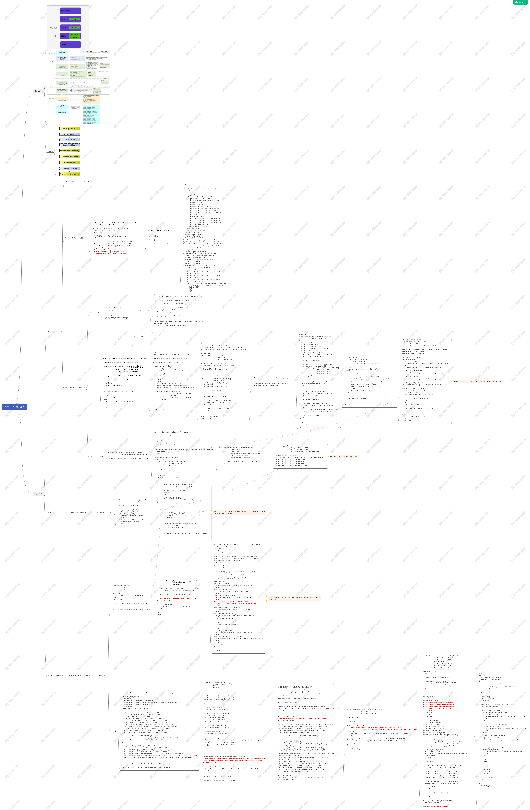

VGPU-Note 虚拟化GPU的一些研究记录

/esxi-bin  ==  带符号版的exsi vmware bin
/poc-debug  ==  从vmware svga sdk 中扣出来用于调试VGPU 基本IO 的代码
/poc-svga  ==  调试vmware VGPU shader 的漏洞
/ppt  ==  看过并做点笔记的VGPU Slide
/virglrenderer-master  ==  qemu 开源的vgpu 框架,包含去年fuzz crash case和fuzz 入口
vrigl-arch.jpg  ==  virgl 架构
virgl_gpu_3d.pptx  ==  投稿的一篇未完成的ppt
vmware-svga-20091021.zip  ==  vmware svga sdk

攻击面脑图,用mindmaster打开
qemu-virgl vgpu方案.emmx

VmWare vGPU方案.emmx

VMWare Esxi 7.emmx

